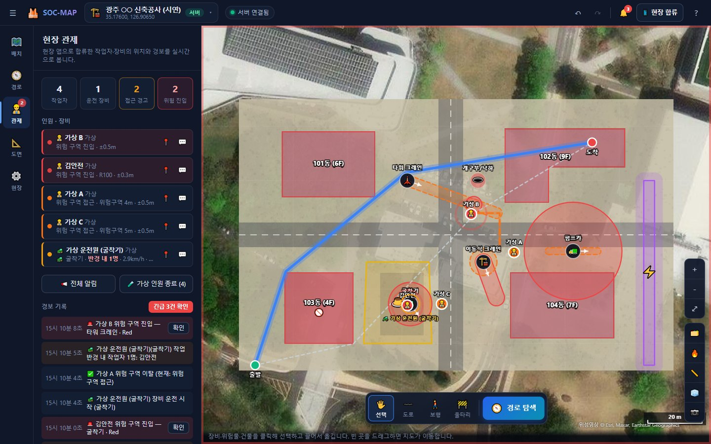

# 김호성 · 전남대학교 건축공학과

전남대학교 건축공학과 21학번 김호성의 개인 홈페이지입니다. 대표 프로젝트인 **SOC-MAP(공사 현장 위험 관제 시스템)** 의 소개 페이지와 라이브 데모를 함께 담고 있습니다. 빌드 과정이 없는 정적 사이트라 GitHub Pages에 그대로 올리면 됩니다.



## 페이지 구성

| 주소 | 내용 |
|---|---|
| `/` | **개인 소개** — 프로필, 소개, 대표 프로젝트, 프로젝트에서 다룬 분야, 학력, 연락 |
| `/projects/soc-map/` | **SOC-MAP 상세** — 배경, 핵심 기능, 위험 반경 시뮬레이터, 화면(관리자 5종 · 현장 앱 5종), 작동 원리, 시스템 구조, 실행 방법, 한계 |
| `/projects/soc-map/demo/` | **라이브 데모** — 서버 없이 동작하는 SOC-MAP 관리자 화면 (「🧪 샘플 현장」으로 시작) |

### SOC-MAP 한 줄 소개
공사 현장을 실제 GPS 위치에 등록하고, KOSHA 기준 장비 위험 반경을 실제 거리(m)로 계산합니다. 작업자와 장비 운전원의 휴대폰이 서로 위치를 공유해 위험 구역 접근·진입을 서로 경보합니다.

## 폴더 구조

```
index.html                     개인 홈
404.html
assets/
  css/style.css                디자인 (다크 테마, 반응형) — 두 페이지 공용
  js/config.js                 ★ GitHub 프로필 · 저장소 · 이메일 주소 설정
  js/main.js                   내비 · 등장 효과 · 화면 탭 · 확대 보기 · 코드 복사
  js/risk-demo.js              위험 반경 시뮬레이터 (SOC-MAP 페이지)
  img/                         스크린샷 · 아이콘
projects/soc-map/
  index.html                   SOC-MAP 상세 페이지
  demo/                        라이브 데모 (SOC-MAP 관리자 화면 사본)
scripts/
  sync-demo.ps1                앱 폴더에서 demo/ 를 다시 복사
  capture-screenshots.py       실행 중인 앱에서 스크린샷 자동 촬영
.github/workflows/pages.yml    GitHub Pages 자동 배포
```

## 내 PC에서 미리 보기

```bash
python -m http.server 8080
```

브라우저에서 `http://localhost:8080` 을 엽니다.

## GitHub에 올리기

개인 홈페이지이므로 저장소 이름을 **`GitHub아이디.github.io`** 로 만들면 `https://GitHub아이디.github.io/` 주소로 바로 열립니다. 다른 이름(예: `portfolio`)으로 만들면 `https://GitHub아이디.github.io/portfolio/` 가 됩니다.

1. `assets/js/config.js` 를 채웁니다. 비워 둔 항목의 버튼은 자동으로 숨겨집니다.
   ```js
   window.SITE_CONFIG = {
     github: 'https://github.com/아이디',
     repo:   'https://github.com/아이디/soc-map',   // SOC-MAP 소스 저장소 (있다면)
     email:  '',                                    // 공개해도 되는 연락용 주소만
   };
   ```
2. 이 폴더를 올립니다.
   ```bash
   git init
   git add .
   git commit -m "개인 홈페이지"
   git branch -M main
   git remote add origin https://github.com/아이디/아이디.github.io.git
   git push -u origin main
   ```
3. 저장소 **Settings → Pages → Build and deployment → Source** 를 **GitHub Actions** 로 바꿉니다. `main`에 올릴 때마다 사이트가 다시 배포됩니다.
   - Actions 대신 **Deploy from a branch** (`main` / `root`) 를 써도 됩니다. `.nojekyll` 이 있어 그대로 동작합니다.

## 내용 고치기

- 개인 소개 문구는 `index.html`, 프로젝트 설명은 `projects/soc-map/index.html` 에 있습니다.
- 프로젝트를 더 추가하려면 `projects/새이름/index.html` 을 만들고, `index.html` 의 「프로젝트」 섹션에 카드를 하나 더 넣으세요.
- **라이브 데모 갱신** (앱을 고친 뒤, PowerShell):
  ```powershell
  ./scripts/sync-demo.ps1 -Source "..\SOC-MAP v12"
  ```
- **스크린샷 다시 찍기** (앱 서버를 켠 상태, Chrome 필요). 촬영용 서버 프로젝트가 하나 생기니 끝나면 앱의 `backend/projects/` 에서 지우세요.
  ```bash
  pip install websockets
  python scripts/capture-screenshots.py assets/img --base http://localhost:8765
  ```

## 사용한 외부 자원

| 자원 | 용도 | 라이선스 |
|---|---|---|
| [Pretendard](https://github.com/orioncactus/pretendard) | 글꼴 (jsDelivr CDN) | SIL OFL 1.1 |
| Esri World Imagery | 스크린샷 · 데모의 위성 지도 | Esri 이용 약관 (화면에 출처 표시) |
| OpenStreetMap | 데모의 일반 지도 | ODbL |
| Three.js, qrcodejs | 데모의 3D · QR (CDN) | MIT |

## 라이선스

[MIT](LICENSE) © 2026 김호성. SOC-MAP은 연구·교육용 시제품이며 법정 안전 관리를 대신하지 않습니다.
